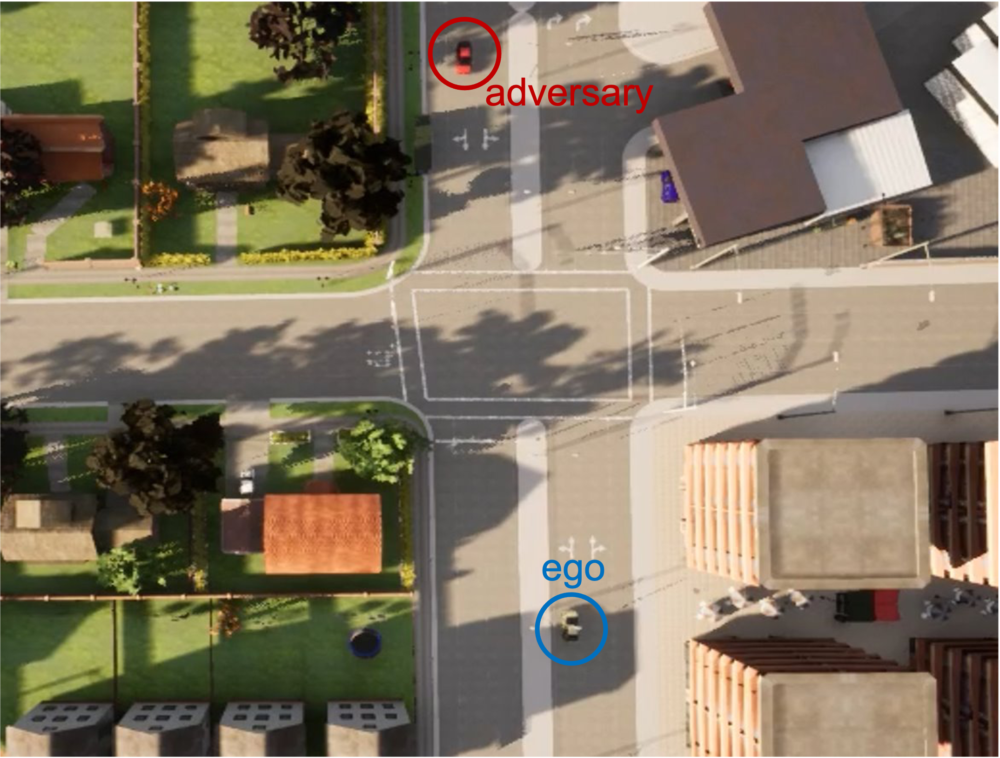

# multiagent-automation
Run multiple autoware agents in CARLA simulator
<!--  -->


## Setup
Follow the CARLA-Autoware setup instructions [here](https://github.com/carla-simulator/carla-autoware)

## Shell script modification
In the original run.sh, add a bash command which specifies the ROS master in the docker image and starts the agent, as shown in run_hero.sh and run_hero1.sh\
Please note we need different agent names in different docker images

## Run multiple agents

1. Run a CARLA server.

```
./CarlaUE4.sh
```
2. Run the `carla-autoware` image and start the first agent hero: 

```sh
./run_hero.sh
```
3. In another tab, run the `carla-autoware` image and start the second agent hero1: 

```sh
./run_hero1.sh
```
4. Alternatively, we can use a shell script to start agent hero and hero1 simutaneously: 

```sh
./run_test.sh
```
This opens two tabs, one for run_hero.sh and one for run_hero1.sh\
I'm using mate terminal here, please modify accordingly.


